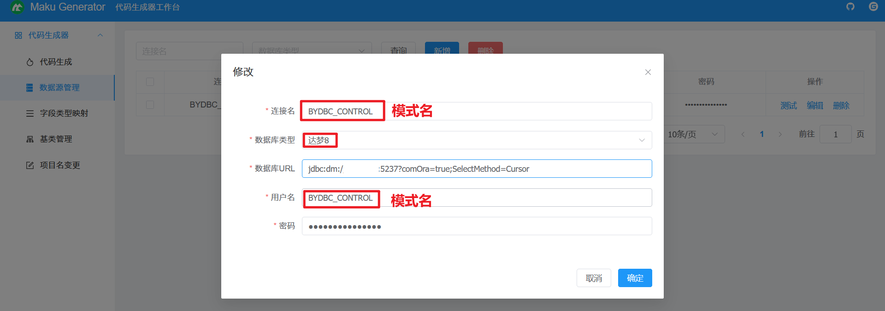
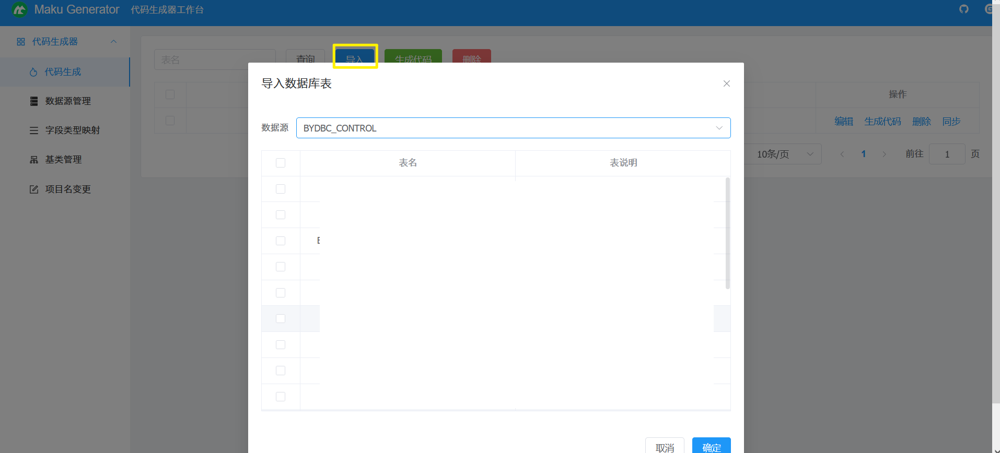
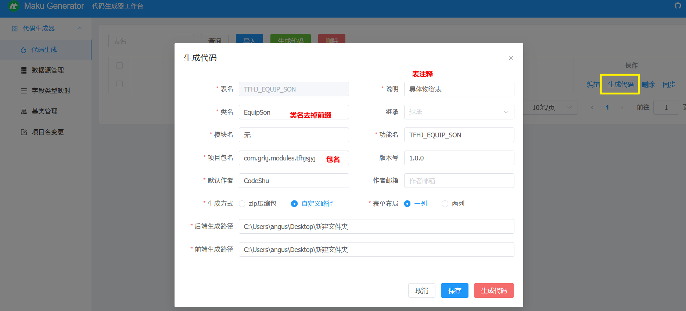

# 一、官网

https://maku.net/docs/maku-generator/712701  

注意：Service.java.ftl 针对没有逻辑删除字段 DEL_FLAG 的，ServiceDelFlag.java.ftl 则是针对逻辑删除的

# 二、访问路径

http://localhost:8088/maku-generator/index.html#/gen/generator

# 三、添加数据源

数据库类型是达梦8，需要注意的是 `每个模式需要建立一个数据源`：

1. 连接名：`模式名`，她将会用在实体类的 @Table 的 schema 属性上，也会用在 xml 查询中
2. 数据库 URL：到 dev 配置文件 copy 下来
3. 用户名：`模式名`，BYDBC_STANDER、BYDBC_INSPECT、BYDBC_CONTROL 等等
4. 密码：...
   

# 四、导入表

去导入自己需要生成代码的表：

# 五、生成代码

选择某个表去生成代码：

1. 类名记得 `去掉前缀`
2. 填写包名
   
